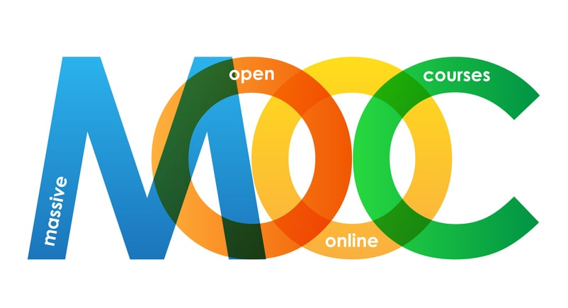
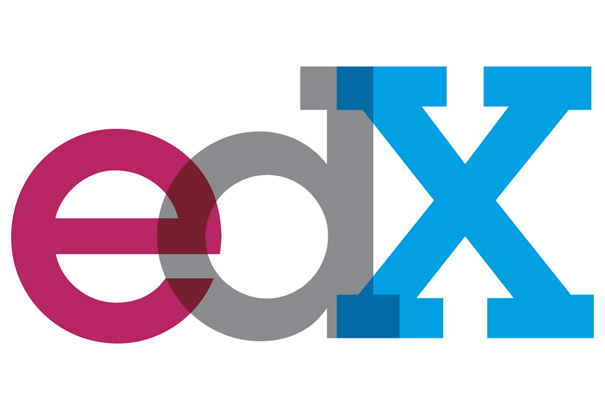

# Data Analitycs (MOOC`S)

En este proyecto, almacenaremos todos los archivos necesarios para el análisis exploratorio en Visual Studio, utilizando el 
lenguaje Python. 
También incluiremos los archivos de visualización de Power BI. Todos estos archivos se encontrarán en el siguiente enlace de 
Google Drive.

El objetivo principal de este proyecto es realizar análisis de datos, centrándonos principalmente en el ámbito del data 
analytics.
https://drive.google.com/drive/folders/1gcsTUBDLX6x6JVkGOSS9jzL08HH-1vCv

Las MOOCs han revolucionado el panorama educativo en todo el mundo, brindando acceso a la educación de calidad de 
manera gratuita o a precios accesibles. Su impacto en Latinoamérica ha sido significativo, permitiendo a miles de 
personas adquirir conocimientos y habilidades en diversos campos.

Con el avance de la Inteligencia Artificial (IA), el alcance y la calidad de las MOOCs en Latinoamérica han mejorado
considerablemente. Utilizando un conjunto de datos de cursos de edX, llevamos a cabo un análisis exhaustivo para 
crear una MOOC exitosa enfocada en tecnología y ciencia de datos.

Comenzamos explorando el conjunto de datos de EDX y realizando transformaciones y limpieza para obtener información 
relevante. Eliminamos columnas innecesarias, como sílabas, URL, descripción detallada y título, para enfocarnos en 
los aspectos más relevantes para nuestro proyecto. A continuación, presentamos las conclusiones y recomendaciones 
basadas en el análisis

Duración y precios de los cursos Encontramos que la mayoría de los cursos requieren una disponibilidad de 2 a 4
horas por semana y tienen una duración de 5 semanas en promedio. Además, la tarifa más común se encuentra en el 
rango de 4 a 49 dólares, lo cual indica que los precios accesibles son atractivos para los estudiantes.

Cursos más populares Identificamos que la mayoría de los cursos son videos grabados, en lugar de cursos en vivo. 
Además, la mayoría de los cursos son introductorios, lo que indica una alta demanda de cursos que brinden una 
introducción sólida a los temas.

Duración y precios de los cursos Encontramos que la mayoría de los cursos requieren una disponibilidad de 2 a 4
horas por semana y tienen una duración de 5 semanas en promedio. Además, la tarifa más común se encuentra en el 
rango de 4 a 49 dólares, lo cual indica que los precios accesibles son atractivos para los estudiantes.

Categorías destacadas Descubrimos que las categorías más populares son ciencia de datos y negocios. Realizamos 
un análisis adicional extrayendo las palabras más utilizadas en los títulos, lo que nos llevó a crear categorías 
específicas como desarrollo web, desarrollo de software y ciencia de datos. Estas categorías se alinean con las 
tendencias tecnológicas y representan áreas de interés para los estudiantes.

Además, se identificó que solo dos instituciones, la Universidad de Michigan y la Universidad de Queensland, tienen 
una amplia oferta de cursos en el campo de la ciencia de datos. Esta especialización en ciencia de datos por parte 
de estas instituciones sugiere una fortaleza en este campo en particular.

Importancia del idioma español y profesores latinos Observamos que la mayoría de los cursos tienen subtítulos 
en español y la cantidad de cursos en español es relevante,pero podriamos mejorar esa parte. Esto nos indica la 
importancia de crear cursos en español, con profesores latinos que puedan brindar una experiencia educativa más 
cercana a la comunidad latina.

se observó que la mayoría de las instituciones ofrecen sus cursos en inglés. Sin embargo, se identificó que dos 
instituciones, la Universidad Politécnica de Valencia y el Banco Interamericano de Desarrollo (BID), tienen una 
presencia significativa en la emisión de cursos en español.

La Universidad Politécnica de Valencia se destaca por ofrecer una variedad de cursos en español, brindando así 
oportunidades educativas a aquellos que prefieren estudiar en su idioma nativo. Esto puede resultar especialmente 
beneficioso para personas que no se sienten cómodas o tienen barreras para estudiar en inglés.

Por otro lado, el Banco Interamericano de Desarrollo también juega un papel importante al ofrecer cursos en español.
Como organización enfocada en el desarrollo económico y social de América Latina y el Caribe, su enfoque en cursos en 
español refleja su compromiso con la accesibilidad y la promoción de la educación en la región

Mediante análisis multivariables, se ha descubierto que la Universidad de Berkeley destaca por ofrecer precios más 
accesibles para sus estudiantes, con una mayor cantidad de inscritos en cursos cuyos precios oscilan entre 4 y 200 
dólares. Por otro lado, se observa que la Universidad de Queensland y la Universidad de Massachusetts ofrecen cursos
con precios más elevados.

se puede observar una relación clara entre el nivel de un curso y su duración en semanas. A medida que se avanza en 
los niveles, los cursos tienden a tener una duración más larga. Estos hallazgos pueden ayudar a los estudiantes a 
seleccionar cursos de acuerdo con la disponibilidad de tiempo y el nivel de profundidad que deseen alcanzar en un 
determinado tema.

Análisis de correlación: Realizamos una matriz de correlación para examinar las relaciones entre variables numéricas
como el número de inscritos, la duración en semanas y el precio en dólares. Descubrimos que la correlación entre 
el número de inscritos y el precio es muy baja (0.047), lo que indica que el precio no es un factor determinante en 
la decisión de inscripción de los estudiantes. Además, encontramos una correlación moderada (0.16) entre la duración 
en semanas y el número de inscritos. Esto sugiere que los estudiantes prefieren cursos con una duración flexible.

Basándonos en estas conclusiones y recomendaciones, estamos listos para crear una MOOC exitosa en Latinoamérica, 
centrada en tecnología y ciencia de datos. Nuestro enfoque se basará en ofrecer cursos introductorios en tecnología, 
especialmente en áreas como desarrollo web, desarrollo de software y ciencia de datos. Aprovecharemos la disminución
en el ingreso a las universidades en Latinoamérica, brindando una alternativa educativa flexible y asequible.

Oportunidad de mercado en Latinoamérica:

Encontramos una disminución en el número de estudiantes que ingresan a las universidades en Colombia, lo cual indica una gran oportunidad 
para la educación en línea. Esta situación nos brinda la posibilidad de abordar a estos estudiantes que se gradúan y evitar que pierdan 
tiempo en otras actividades, ofreciéndoles alternativas de aprendizaje a través de cursos en línea.

Nuestra recomendación es enfocar nuestros esfuerzos en crear cursos en español que permitan un fácil acceso a más clientes. Al desarrollar 
cursos en línea, estamos brindando la flexibilidad necesaria para que los estudiantes puedan avanzar en sus estudios sin tener que 
enfrentar barreras geográficas o de horarios.

Es relevante destacar que muchos estudiantes cuentan con el apoyo económico de sus padres.
Estos cursos estarán enfocados en programación, proporcionando a los estudiantes una base sólida y práctica en esta área, lo cual les 
permitirá dar un inicio sólido a su trayectoria educativa.

Buscaremos asociaciones estratégicas con instituciones destacadas en ciencia de datos, como la Universidad de Queensland, para fortalecer 
nuestra oferta y atraer a estudiantes interesados en especializaciones más avanzadas.

En resumen, nuestro objetivo es crear una MOOC exitosa en Latinoamérica, adaptada a las necesidades y demandas de 
los estudiantes. Aprovecharemos el poder de la tecnología, la IA y la colaboración con instituciones destacadas 
para 
ofrecer una experiencia educativa de alta calidad y contribuir al desarrollo de habilidades en tecnología y ciencia 
de datos en la región.

 

Cursos pagos: Los análisis univariantes revelaron que la mayoría de los cursos en Udemy son de pago, con una gran 
diferencia respecto a los cursos gratuitos. Esto indica que es importante considerar un modelo de negocio basado en 
cursos de pago.

Valor agregado: Para crear un MOOC exitoso, es recomendable ofrecer valor agregado a los estudiantes. Esto se puede 
lograr proporcionando material complementario descargable, ejercicios prácticos, proyectos reales o acceso a una 
comunidad de aprendizaje en línea. Estas características adicionales pueden aumentar el atractivo de los cursos y 
brindar una experiencia más enriquecedora para los estudiantes.

Precio competitivo: Es aconsejable establecer un precio competitivo dentro del rango común en Udemy, que generalmente 
es alrededor de $25. Un precio atractivo puede ayudar a atraer a más estudiantes interesados en el tema del curso.

Fomentar la interacción y la retroalimentación: Es recomendable diseñar el curso para fomentar la interacción entre 
los estudiantes y facilitar la retroalimentación. Esto se puede lograr mediante el uso de foros de discusión, sesiones
 en vivo y revisiones de proyectos. La interacción y la retroalimentación promueven un mayor compromiso de los 
estudiantes y una mejor experiencia de aprendizaje.

Palabras clave estratégicas: Al analizar los títulos de los cursos, se identificaron las palabras clave más populares, 
como 'Principiante', 'Aprender', 'Trading' y 'Curso'. Estas palabras pueden ser utilizadas estratégicamente al crear 
un MOOC para atraer a un público más amplio y destacar las características únicas del curso.

Asignatura popular: La asignatura de "Desarrollo web" es la que tiene más suscriptores en Udemy. Por lo tanto, es 
recomendable considerar la creación de cursos relacionados con el desarrollo web para aprovechar esta demanda existente.

Duración de los cursos: Los cursos de "Desarrollo web" suelen tener una duración superior a 5 semanas. Es importante 
determinar si la duración se refiere a semanas o horas para ofrecer una estimación precisa del tiempo requerido para 
completar el curso.

Popularidad y reseñas: Los cursos de "Desarrollo web" también tienen más reseñas en comparación con otras asignaturas.
 Esto indica una mayor participación y satisfacción de los estudiantes en esta área. Al crear un MOOC, es beneficioso 
tener en cuenta esta popularidad y esforzarse por obtener buenas reseñas para aumentar la reputación y atractivo del 
curso.

Matriz de correlación: Al realizar un análisis de correlación, se encontró que el precio tiene una correlación baja 
con el número de inscritos (-0.27) y no está significativamente relacionado con el número de inscritos (0.051). Sin 
embargo, se observa una correlación moderada positiva entre la duración del contenido y el precio (0.16). Esto 
sugiere que los cursos con una duración más larga tienden a tener un precio ligeramente más alto.

Tendencias de precios y número de cursos: Al analizar los gráficos de líneas, se observa un aumento constante en el 
precio de los cursos desde 2012, superando los máximos anteriores. Por otro lado, el número de cursos y suscriptores 
ha disminuido desde 2016, junto con la duración de los cursos. Estas tendencias deben ser consideradas al diseñar un 
nuevo MOOC y ajustar la estrategia de precios para adaptarse al mercado actual.

 

En un análisis exhaustivo de Coursera, se descubrió que la institución con la mayor cantidad de cursos 
era la Universidad de Michigan, con un asombroso total de 57,197 cursos. Era evidente que esta 
institución se había convertido en líder en la oferta de contenido educativo en línea.

En segundo lugar, se encontraba el campo del "Deep Learning" con 40,329 cursos disponibles. Aunque 
había una diferencia considerable con respecto a la Universidad de Michigan, el "Deep Learning" 
demostró ser un tema de gran interés y demanda por parte de los estudiantes.

Sin embargo, en el tercer lugar, se encontraba una categoría con una diferencia notable de cursos. 
Con un total de 26,938 cursos, se ubicaba en una posición más alejada en comparación con los dos 
primeros lugares. A pesar de esto, seguía siendo una opción popular para aquellos interesados en 
ampliar sus conocimientos.

Otro hallazgo importante en el análisis fue que las instituciones GitLab y U estatal de campinas tenían 
las calificaciones más altas. Ambas instituciones obtuvieron un promedio de 5 y 4.9, respectivamente. 
Esto indicaba que los estudiantes estaban satisfechos con la calidad de los cursos ofrecidos por 
estas instituciones y las recomendaban ampliamente.

En el análisis univariante, se observó que la mayoría de las calificaciónes son de 5 estrellas, 
lo que quintuplicaba al segundo puesto, que era una calificación de 4 estrellas. Esto 
revelaba que los estudiantes estaban altamente satisfechos con la calidad y el contenido de los 
cursos que tomaban.

En cuanto a los cursos mejor calificados, se encontró que el "Machine Learning","Soporte Técnico" 
y "Python" lideraban con una calificación de 5 estrellas. Estos cursos eran altamente valorados por 
su contenido, métodos de enseñanza y relevancia en el mundo laboral.

En términos de distribución de cursos por institución, la Universidad de Michigan llevaba la delantera
con un impresionante 33.1% del total de cursos disponibles en Coursera. La categoría "Deep Learning"
ocupaba el segundo lugar, con un 23%. Además, se descubrió que las cinco instituciones principales se 
llevaban el 98.9% de todos los cursos ofrecidos en la plataforma, lo que destacaba la importancia de 
estas instituciones en el ecosistema de Coursera.

Para ilustrar los cambios en las calificaciones a lo largo del tiempo, se creó un gráfico de líneas. 
Este gráfico mostraba que las calificaciones en Coursera cayeron drásticamente en el año 2016 debido a 
varios factores, incluyendo la cantidad de reseñas negativas recibidas. Sin embargo, a partir del año 
2020, se observó una mejora gradual en las calificaciones, lo que indicaba que Coursera había realizado
correcciones y mejoras para brindar una experiencia de aprendizaje de mayor calidad.

Además, se descubrió que el año 2019 fue de un crecimiento exponencial en la cantidad 
de cursos ofrecidos en Coursera. Esto indicaba un interés creciente por parte de los estudiantes en 
el aprendizaje en línea. Sin embargo, también se notó una tendencia en la que los meses de abril 
tenían la mayor cantidad de cursos, mientras que la oferta disminuía gradualmente hasta diciembre.

Finalmente, se notó que los cursos más populares en Coursera eran los relacionados con Python y 
Machine Learning. Estos temas atraían a una gran cantidad de estudiantes interesados en desarrollar 
habilidades en programación y análisis de datos, lo que los convertía en una opción muy solicitada.

En resumen, Coursera se había consolidado como una plataforma líder en la oferta de cursos en línea 
en Latinoamérica. La Universidad de Michigan se destacaba como la institución con más cursos, mientras 
que GitLab y UCL School obtenían las mejores calificaciones. Los cursos de Machine Learning, Soporte 
Técnico y Python eran los mejor valorados, y los años 2018 y 2019 vieron un crecimiento exponencial en 
la oferta de cursos. Con su amplia variedad de cursos y el compromiso de proporcionar una educación de
 calidad, Coursera se había convertido en un pilar para el aprendizaje en línea en la región 
latinoamericana.

